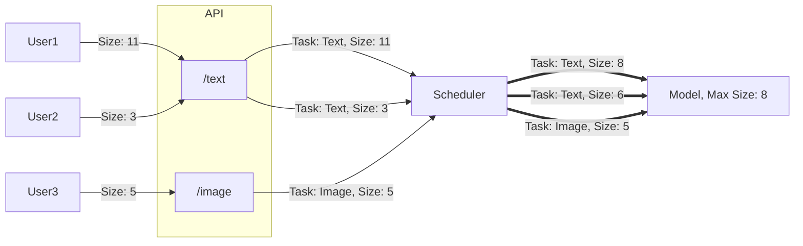

# Inference API
This repo is a reusable Python module to create consistent APIs.
The module has the benefits:
- Easy to API'rize a model. 
- Handles process pooling ensuring that the event-loop of FastAPI is not blocked. Enables health checks, documentation requests and metrics to be accesible even when the model is inferencing and using most of the CPU.
- Creating this package allows for new learnings to be easily reused across our APIs/models.

## Mental model of the package
The goal of the package is to seperate the CPU/GPU intensive part of ML inference from the async web API non-blocking nature. Easy to use "Dynamic Batching" is also a huge part of it. Inference requests are received in the `API` using the FastAPI framework and then forwarded to the `Scheduler`. Depending on the type of `Scheduler` different batching (or no batching) strategies can be used to optimize performance. The `Scheduler` forwards batches to a `Model`. 

A `Model` can be a Multi-Task `Model` by defining multiple `Task`s in the model implementation. This is useful for embedding models that has multiple ways of embedding like "passage" or "query", or multimodal models like CLIP that embeds both text and images with different preprocessing pipelines.

The `Scheduler` used should vary depending on how the `Model` is implemented and the requirements for it.


#### `BatchScheduler`
The general `BatchScheduler` uses the following concept:

Multiple requests with the same task are batched together for more efficient usage of the device.

The Dynamic Batching algorithm can take the following into account:
1. Time since batch was started. 
2. Statically defined maximum batch size (`INFERENCE_MAX_BATCH_SIZE`)
3. Task-specific maximum_batch_size (`INFERENCE_MAX_BATCH_SIZE_<TASKNAME>`) **(Not implemented)**
3. Dynamic RAM/VRAM requirements. **(Not implemented)**
    - Padding-aware batching. Each element in the batch is padded to the longest element. 
    - Uses an estimation model (linear regression) to estimate memory required for a batch and limits accordingly. The estimation tool is required to set parameters.

## Included in the package
The main class of the package derives from the usual `FastAPI` object class, but adds a lot of default things on top. This includes:
- Creates the `ProcessPool` and initates the defined Model class on warmup.
- Loads environment variable settings. These can be extended by providing a class extending `BaseSettings` (see example linked below)
- Sets up a logger and defines routes to be ignored, like `/health` and `/metrics` to avoid overblown logging file.
- Wraps a `predict` function and automatically handles errors and times the inference
- Sets up automatic Swagger documentation by adding required static files and `/docs` route
- Sets up instrumentation for Prometheus metrics collection. Default includes inference time histogram metric in high resolution and all API endpoints in low resolution.

## How to use
The module will at some point be a an actual Python module. For now, it is just `pip install`'ed through git either directly 

```
pip install git+https://..../inference_api.git@<VERSION_TAG>
```

or through `pip install -r requirements.txt`

```
transformers==4.40.2
inference_api @ git+https://.../inference_api.git@<VERSION_TAG>
aiofiles==23.2.1
```
One can also use the `VERSION_TAG` as `main` to just follow the main branch. Otherwise we follow basic semantic versioning [tags](https://.../inference_api/-/tags) e.g. `v0.0.9` and so on.


An example of using the package can be found in [example](https://.../inference_api/-/tree/main/example)


## About Process Pools
On of the primary goals of this package is to simply using a model in a Python `ProcessPool`. Think of this as splitting the API web requests handling workload from the model inference workload into two "programs" (ie. processes). We can then using Python's `await` from the API process to wait for a inference task to finish in the model process. This allows other web requests like health checks, metric collection, Swagger documentation etc. to be handled even while a model inference task is being awaited.

If we did not do this, all other web requests would be blocked, making the API appear unresponsive to users of documentation and systems relying on health checks like Docker Compose/Swarm or HAProxy.

### Notes
Note that calling model inference using the process pool is queued if a model inference task is already running. We default to a single worker (can be configured). 

Also note that the inference task queue is in memory, so if the service crashes all requests are lost.

Python has both `ThreadPool` and `ProcessPool` but since most models itself uses multiple threads, it makes more sense to split by process.

## Functions
### predict
The predict function returns the `inference_time` and the `result` from the predict-function in the model-class. ([See code](https://.../inference_api/-/blob/main/inference_api/inference_api.py#L135))

